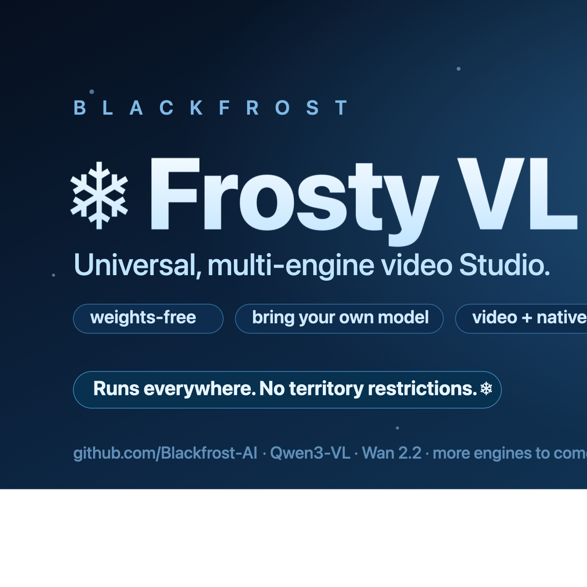

# Frosty VL — a universal, multi-engine video Studio

Frosty VL is a **universal, multi-engine video Studio** by Blackfrost — one API and
one browser Studio across pluggable render engines. It ships **no model weights**:
you bring your own base model. On the Qwen3-VL engine it adds **persona-steering** by
projecting direction vectors onto a copy of the pipeline's Qwen3-VL text encoder in
memory at load — the base pipeline on disk is never modified. Additional engines
(Wan 2.2 TI2V) plug in the same way, with **more to come.**

This package is the complete customer deployment for the Frosty VL V1 service
and its browser Studio.

**This is the SAFE release.** It is a video generator with the browser Studio UI
on port 8890, with the golden-safety floor **ON** by default
(`FVL_SAFETY_LAM=3.0`). You **bring your own Qwen3-VL-based weights** — the plugin
ships no model weights. All steering is a runtime, in-memory projection onto a
copy of the text encoder; the base pipeline on disk is never modified.

It provides:

- text-to-video with synchronized native audio;
- image-to-video using an uploaded opening frame;
- Ref2VA **Same person lock** using a subject reference image;
- 5, 8, 10, 12, and 14-second clips;
- Scene Lab for 2–8 sequential scenes with optional match-cut continuity;
- a persistent gallery rebuilt from the output directory after every refresh;
- a model-selection menu with engine-aware capabilities and compact advanced settings;
- an OpenAI-style API plus the browser UI on port 8890;
- a two-GPU container topology for B200-class hardware.

## Engines & roadmap

Frosty VL is engine-agnostic — the Studio and API stay the same while engines plug in:

- **Qwen3-VL** — persona-steering + golden-safety floor (this release); bring your own weights.
- **Wan 2.2 TI2V** — Apache-2.0 text/image-to-video (optional profile).
- **More to come** — additional engines and capabilities are on the roadmap.

## Package boundaries

Included in this folder and baked into the customer image:

- FastAPI render server and local-pipeline loader;
- the browser Studio UI/proxy;
- Frosty VL persona-steering direction and its extraction metadata;
- container, Compose, preflight, download-helper, and support scripts.

**Not included — you supply it yourself:**

- the base model: your own Qwen3-VL-based diffusion pipeline (the complete
  modular pipeline directory with text_encoder, transformer, VAEs, etc.). You
  obtain and license this model yourself. This plugin ships, hosts, and
  downloads no model weights and defaults to no specific model source.

## Architecture

```text
browser :8890
  -> studio container
       -> render server container :8899
            -> FL2VA on cuda:0
            -> Ref2VA on cuda:1
            -> read-only base-pipeline mount
            -> generated MP4 output mount
```

Both Compose services use the same built image. Your base pipeline is mounted
read-only and is never copied into the image or modified on disk.

## Host requirements

- Linux x86_64;
- two NVIDIA B200-class GPUs with approximately 180 GiB VRAM each;
- current NVIDIA driver, Docker Engine, Docker Compose v2, and NVIDIA Container
  Toolkit;
- enough free storage for your base pipeline, image layers, and initial output
  (a full BF16 Qwen3-VL video pipeline is on the order of several hundred GB);
- your own copy of a compatible Qwen3-VL-based diffusion pipeline.

The image is based on `nvcr.io/nvidia/pytorch:26.07-py3`. The host needs the
NVIDIA driver and Container Toolkit; it does not need a separate host CUDA or
Python environment.

## Install

### 1. Provide the base pipeline

Place your own Qwen3-VL-based diffusion pipeline at a persistent host path. You
can either copy it there directly, or use the download helper against a model
source you control:

```bash
# Option A: you already have the pipeline directory — just point at it.
export FVL_MODEL_DIR=/models/base-pipeline

# Option B: fetch your own model with the helper (no default source is assumed).
python3 -m pip install --user --upgrade huggingface_hub
hf auth login
export FVL_MODEL_REPO=<your/qwen3-vl-pipeline-repo>
export FVL_MODEL_DIR=/models/base-pipeline
./scripts/download-model.sh
```

The helper verifies the complete modular layout (text_encoder, transformer,
transformer_ref, VAEs, schedulers, etc.). Re-running it resumes rather than
replacing valid files.

### 2. Configure Compose

```bash
cp env.docker.template .env
mkdir -p /srv/frosty-vl/outputs
```

Edit `.env` and set the absolute `FVL_MODEL_DIR` (your base-pipeline directory)
and `FVL_OUTPUT_DIR` paths. GPU 0 serves FL2VA and GPU 1 serves Ref2VA by
default.

### 3. Build and preflight

```bash
docker compose build
./scripts/container-preflight.sh
```

The preflight checks the base-pipeline tree, direction shape, the experimental
Diffusers Qwen3-VL modular imports, CUDA visibility, and GPU memory without
loading model weights.

### 4. Start

```bash
docker compose up -d
docker compose logs -f frosty-vl-server
```

The initial startup is long: FL2VA loads before the server becomes healthy,
then Ref2VA warms on the second GPU. Wait until both readiness fields are true:

```bash
curl http://127.0.0.1:8899/health
```

Expected final state:

```json
{"status":"ok","ready":true,"reference_ready":true}
```

Open the Studio at `http://localhost:8890` and run the API smoke test:

```bash
./scripts/smoke-test.sh http://127.0.0.1:8899
```

## Configuration

The host-facing settings are in `.env`:

| Setting | Default | Meaning |
|---|---|---|
| `FVL_MODEL_DIR` | required | Your Qwen3-VL base-pipeline directory on the host |
| `FVL_OUTPUT_DIR` | required | Persistent generated-MP4 directory |
| `FVL_MODEL_REPO` | none | Your own model source, only if you use the download helper |
| `FVL_MODEL_REVISION` | none | Revision of your own model source, if applicable |
| `FVL_FL_GPU` | `0` | FL2VA/text and opening-frame generation GPU |
| `FVL_REF_GPU` | `1` | Ref2VA identity-reference GPU |
| `FVL_API_BIND` | `127.0.0.1` | Raw API bind address |
| `FVL_PORT` | `8899` | Raw API port |
| `FVL_UI_BIND` | `127.0.0.1` | Studio bind address |
| `FVL_UI_PORT` | `8890` | Studio port |
| `FVL_GEN_TIMEOUT` | `2400` | Per-scene proxy timeout in seconds |
| `FVL_GALLERY_LIMIT` | `200` | Maximum number of newest saved videos shown in the Studio gallery |
| `FVL_WAN_MODEL_DIR` | Wan path | Optional local `Wan-AI/Wan2.2-TI2V-5B-Diffusers` checkpoint |
| `FVL_WAN_GPU` | `2` | GPU used by the optional Wan engine |

## Optional Wan 2.2 engine

The Studio supports multiple isolated render engines without exposing a node
graph. Wan 2.2 TI2V 5B adds Apache-2.0 text-to-video and image-to-video with
480p/720p, aspect-ratio, step, guidance, and negative-prompt settings.

Download `Wan-AI/Wan2.2-TI2V-5B-Diffusers` to `FVL_WAN_MODEL_DIR`, then start
the optional Compose profile:

```bash
docker compose --profile wan up -d --build
```

The Wan API remains on the internal Compose network. The Studio is still the
only browser-facing service and displays each engine's live readiness.

Keep port 8899 private. The raw API does not include authentication, tenant
isolation, rate limiting, or output retention.

## Frosty VL directions

The container enables two directions across Qwen3-VL text-encoder
attention-output layers 40–49, both projected in memory when each pipeline
loads. Your mounted base-pipeline files remain pristine.

- `server/data/refusal_dir_L50.npy` — persona-steering direction, lambda
  `3.0` (`FVL_ABL_LAM`).
- `server/data/safety_dir_L50.npy` — golden-safety floor, lambda `3.0`
  (`FVL_SAFETY_LAM`). This SAFE release ships with the safety floor **ON**.

Both bundled L50 vectors are valid 5120-wide Qwen3-VL text-encoder directions.
Their checksums are recorded in `server/data/README.md` and are not claimed to
match any other build's provenance.

## Duration and timeout behavior

The pipeline accepts frame counts of `17*n+5`. The server maps the UI choices as
follows:

| Requested | Frames | Actual at 24 fps |
|---:|---:|---:|
| 5 seconds | 124 | 5.167 seconds |
| 8 seconds | 192 | 8.000 seconds |
| 10 seconds | 243 | 10.125 seconds |
| 12 seconds | 294 | 12.250 seconds |
| 14 seconds | 345 | 14.375 seconds |

A verified 14.375-second identity render took about 1,005 seconds. The old
900-second UI timeout therefore failed even when the backend completed and
wrote the video. This package uses a 2,400-second default. Generation is
serialized in-process, so queue wait also counts toward that timeout.

## Operations

```bash
# Status and logs
docker compose ps
docker compose logs --tail=300 frosty-vl-server
nvidia-smi

# Restart without rebuilding
docker compose restart

# Upgrade source and rebuild
docker compose build --pull
docker compose up -d

# Stop while preserving the base pipeline and outputs
docker compose down
```

Generated MP4s and small JSON metadata sidecars are not automatically expired.
The Studio gallery reads them directly from `FVL_OUTPUT_DIR`, which is mounted
into both containers. Apply the customer's normal retention policy to that
directory.

## Troubleshooting bundle

Collect these when opening a support request:

```bash
docker compose ps
docker compose logs --tail=500 frosty-vl-server
docker compose config
nvidia-smi
du -sh "$FVL_MODEL_DIR"
find "$FVL_MODEL_DIR" -maxdepth 2 -type f | sort
curl -sS http://127.0.0.1:8899/health
```

Do not include `.env`, access tokens, or customer prompts in a public support
attachment.

## Package map

```text
Dockerfile                         B200-capable plugin image
docker-compose.yml                two-service GPU/UI stack
env.docker.template               host paths, ports, and GPU mapping (cp to .env)
CUSTOMER-INSTALL.md               short installation-call checklist
LICENSE-NOTICE.md                 distribution notice
requirements.txt                  Python runtime dependencies
server/                            API, loader, projection, directions
ui/webui.py                    browser Studio
scripts/download-model.sh         optional helper for your own model source
scripts/container-preflight.sh    no-load container validation
scripts/smoke-test.sh             live API/schema check
```